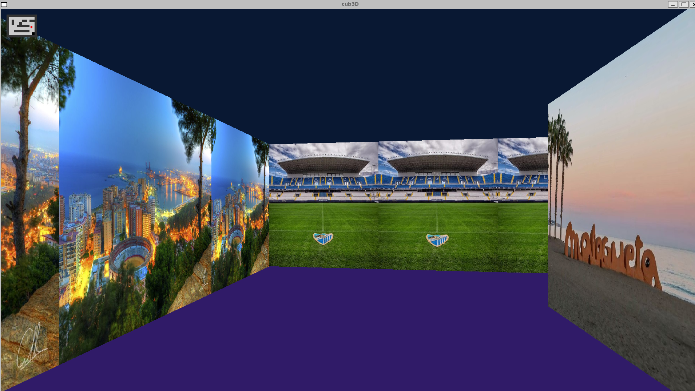

# cub3D 🎮

<div align="center">
    
</div>

## 📝 Descripción
cub3D es un motor gráfico 3D que utiliza la técnica de raycasting para simular un entorno tridimensional en tiempo real, inspirado en el clásico juego Wolfenstein 3D. Este proyecto explora los fundamentos de la programación gráfica, algoritmos de renderizado y matemáticas aplicadas para crear una experiencia visual inmersiva.

## ✨ Características principales
- ✅ Motor de raycasting 3D en tiempo real
- ✅ Renderizado de muros con texturas
- ✅ Sistema de cámara con rotación suave
- ✅ Mapas personalizables con archivos .cub
- ✅ Texturas diferenciadas por orientación (N, S, E, W)
- ✅ Colores configurables para suelo y techo
- ✅ Controles de movimiento fluidos
- ✅ Detección de colisiones con muros (bonus)
- ✅ Sistema de minimapa en tiempo real (bonus)

## 🎯 Características bonus implementadas
- **Wall collisions**: Sistema avanzado de detección de colisiones que previene el movimiento a través de muros
- **Minimap system**: Minimapa en tiempo real que muestra la posición del jugador, orientación y estructura del mapa

## 🛠️ Tecnologías utilizadas
- Lenguaje C
- Biblioteca MLX42 para gráficos
- Algoritmos de raycasting
- Matemáticas vectoriales
- Gestión de texturas
- Parsing de archivos de configuración
- Makefile para compilación
- Git para control de versiones
- Norminette para estilo de código

## 📋 Requisitos previos
- Sistema operativo Unix/Linux o macOS
- GCC compiler
- Make
- Biblioteca MLX42 y sus dependencias
- OpenGL y bibliotecas gráficas del sistema

## ⚙️ Compilación y uso
```bash
# Compilar el proyecto
make

# Compilar con bonus (características adicionales)
make bonus

# Limpiar archivos objeto
make clean

# Limpiar todos los archivos generados
make fclean

# Recompilar
make re

# Ejecutar el juego (versión estándar)
./cub3D maps/map.cub

# Ejecutar con bonus (minimapa y colisiones avanzadas)
./cub3D_bonus maps/map.cub
```

## 🗺️ Formato del archivo de mapa
El archivo `.cub` debe contener:
```
NO ./path_to_north_texture
SO ./path_to_south_texture
WE ./path_to_west_texture
EA ./path_to_east_texture

F 220,100,0
C 225,30,0

1111111111111111111111111
1000000000110000000000001
1011000001110000000000001
1001000000000000000000001
111111111011000001110000000000001
100000000011000001110111111111111
11110111111111011100000010001
11110111111111011101010010001
11000000110101011100000010001
10000000000000001100000010001
10000000000000001101010010001
11000001110101011111011110N0111
11110111 1110101 101111010001
11111111 1111111 111111111111
```

### Elementos del mapa:
- `0`: Espacio vacío
- `1`: Muro
- `N/S/E/W`: Posición inicial del jugador (orientación)
- `F`: Color del suelo (RGB)
- `C`: Color del techo (RGB)
- `NO/SO/WE/EA`: Rutas a las texturas de muros

## 🎮 Controles
- **W/↑**: Mover hacia adelante
- **S/↓**: Mover hacia atrás
- **A**: Mover hacia la izquierda
- **D**: Mover hacia la derecha
- **←**: Girar cámara a la izquierda
- **→**: Girar cámara a la derecha
- **ESC**: Cerrar el juego

## 📚 Funciones implementadas
- **Parser**: Validación y carga de archivos .cub
- **Raycasting**: Algoritmo de trazado de rayos
- **Renderizado**: Dibujo de muros con texturas
- **Gestión de texturas**: Carga y aplicación de imágenes
- **Sistema de cámara**: Rotación y movimiento
- **Detección de colisiones**: Prevención de atravesar muros
- **Gestión de memoria**: Limpieza adecuada de recursos
- **Minimapa (bonus)**: Representación visual del mapa en tiempo real
- **Colisiones avanzadas (bonus)**: Sistema robusto de detección de colisiones

## 🧮 Algoritmo de raycasting
El motor utiliza:
1. **Trazado de rayos**: Desde la posición del jugador
2. **DDA (Digital Differential Analyzer)**: Para detectar intersecciones
3. **Cálculo de distancias**: Para determinar altura de muros
4. **Corrección de distorsión**: Eliminación del efecto "ojo de pez"
5. **Mapeo de texturas**: Aplicación de imágenes a las superficies

## �️ Sistema de minimapa (bonus)
El minimapa incluye:
- Vista aérea del mapa en tiempo real
- Posición actual del jugador
- Dirección de vista del jugador
- Muros y espacios libres claramente diferenciados
- Actualización fluida durante el movimiento

## �🖼️ Mapas incluidos
El proyecto incluye varios mapas temáticos:
- **Málaga**: Inspirado en la ciudad andaluza
- **Alhambra**: Ambiente de palacio árabe
- **Gibralfaro**: Castillo malagueño
- **Hogwarts**: Ambiente mágico
- **Quidditch Pitch**: Campo de quidditch

## 🧪 Testing
El proyecto ha sido probado con:
- Diferentes tamaños de mapa
- Validación de archivos .cub malformados
- Texturas en diversos formatos
- Casos límite de movimiento
- Gestión de memoria (valgrind)
- Rendimiento en tiempo real
- Funcionalidad del minimapa en todos los escenarios
- Sistema de colisiones en diferentes geometrías

## 🎯 Ejemplos de uso
```bash
# Ejecutar versión estándar
./cub3D maps/customised.cub

# Ejecutar versión bonus con minimapa
./cub3D_bonus maps/customised.cub

# Ejecutar mapa inválido para testing
./cub3D maps/maps_errors/2players.cub
```

## ⚠️ Aviso
Este proyecto forma parte del currículum de 42. Si eres estudiante de 42, te animo a desarrollar tus propias soluciones.

<div align="center">
    <p>Desarrollado con ❤️ como parte del currículum de 42</p>
    <br>
    
    
    
    
    
</div>
