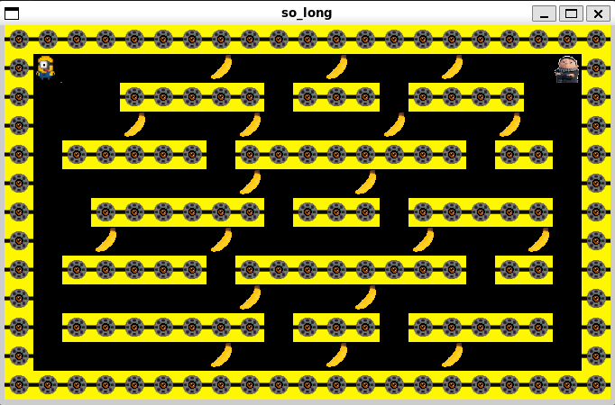

# So_long 🎮

<div align="center">
	
</div>

## 📝 Descripción
So_long es un pequeño juego 2D desarrollado en C utilizando la biblioteca gráfica MinilibX. El jugador debe recolectar todos los coleccionables y llegar a la salida evitando obstáculos, implementando mecánicas básicas de juego y gestión de eventos.

## ✨ Características principales
- ✅ Gráficos 2D con MinilibX
- ✅ Movimiento fluido del personaje
- ✅ Sistema de colisiones
- ✅ Gestión de eventos de teclado
- ✅ Contador de movimientos
- ✅ Validación de mapas
- ✅ Animaciones básicas
- ✅ Gestión de coleccionables

## 🛠️ Tecnologías utilizadas
- Lenguaje C
- MinilibX (biblioteca gráfica)
- Makefile para compilación
- Git para control de versiones
- Norminette para estilo de código

## 📋 Requisitos previos
- Sistema Unix/Linux o macOS
- GCC compiler
- Make
- MinilibX y sus dependencias
- Biblioteca X11

## ⚙️ Compilación y uso
```bash
# Compilar el juego
make

# Limpiar archivos objeto
make clean

# Limpiar todos los archivos generados
make fclean

# Recompilar
make re

# Ejecutar el juego
./so_long maps/map.ber
```

## 🗺️ Formato del mapa
El mapa debe ser un archivo .ber con los siguientes elementos:
- '1': Muro
- '0': Espacio vacío
- 'P': Posición inicial del jugador
- 'C': Coleccionable
- 'E': Salida

Ejemplo:
```
1111111111111
10010000000C1
1000011111001
1P0011E000001
1111111111111
```

## 🎮 Controles
- W/↑: Mover arriba
- S/↓: Mover abajo
- A/←: Mover izquierda
- D/→: Mover derecha
- ESC: Cerrar juego

## 📚 Funciones implementadas
- Renderizado de mapas y sprites
- Gestión de eventos de teclado
- Sistema de colisiones
- Validación de mapas
- Gestión de memoria
- Animaciones básicas
- Control de estado del juego

## 🧪 Testing
El proyecto incluye pruebas para:
- Validación de mapas
- Gestión de memoria
- Manejo de errores
- Comportamiento del juego
- Casos límite

## ⚠️ Aviso
Este proyecto forma parte del currículum de 42. Si eres estudiante de 42, te animo a desarrollar tus propias soluciones.

<div align="center">
    <p>Desarrollado con ❤️ como parte del currículum de 42</p>
    <br>
    
    
    
</div>
